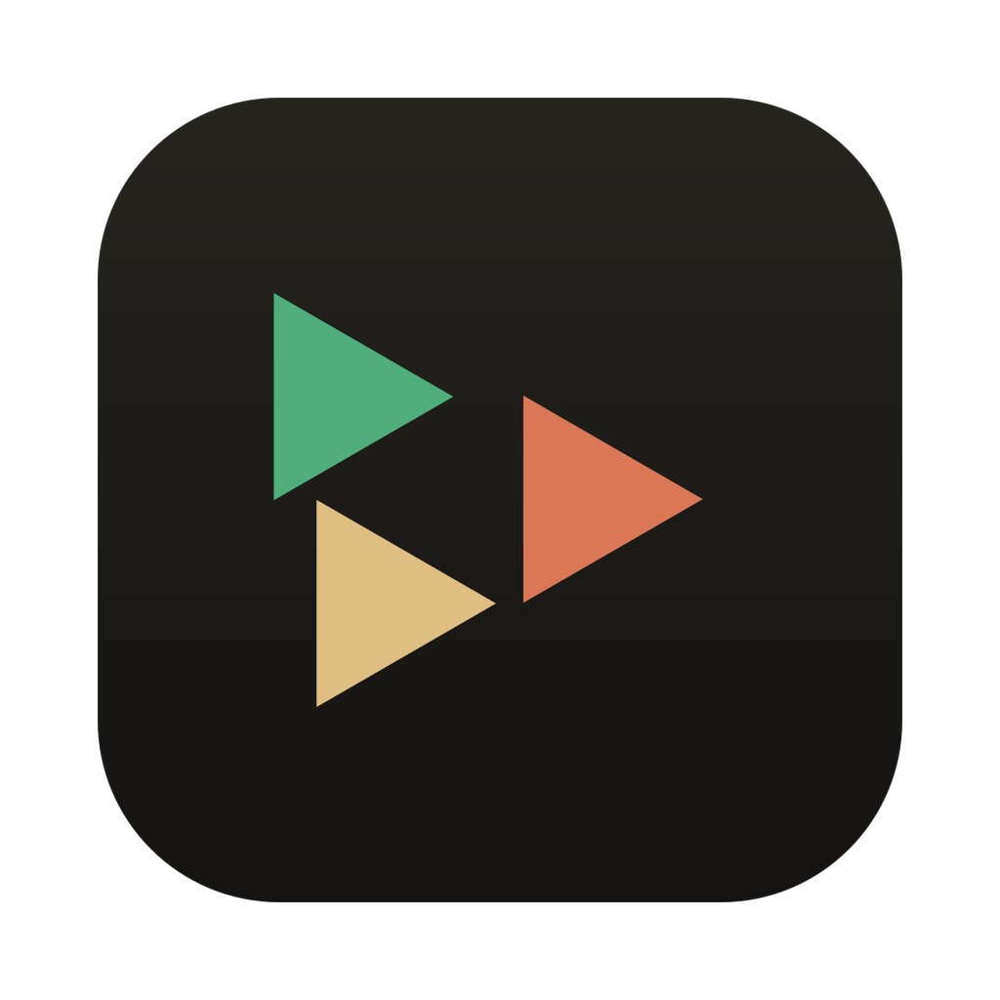
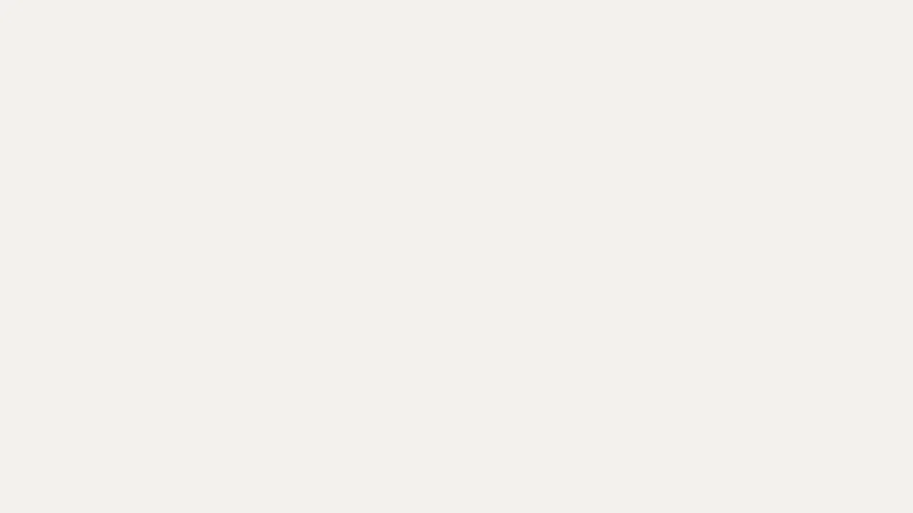

<p align="center">
  
</p>

<h1 align="center">Shoal</h1>

<p align="center">All your agents, in one window.</p>

<p align="center">
  
  <br /><sub><a href="assets/shoal-ad.mp4">Watch the full film with sound</a></sub>
</p>

Shoal is a calm, native-feeling terminal for running many coding agents side by side. Claude Code, Hermes, Codex, Gemini CLI, Oh My Pi, OpenCode, Ollama or a plain shell: each gets its own session in a sidebar, with its logo and a live status, so a glance tells you which one is working and which one needs you.

It is deliberately small. It is not a new terminal emulator. It is real login shells (node-pty) rendered with xterm.js, wrapped in a quiet interface.

## Features

- **Sidebar of sessions** with agent logos, working directory and live status (working, needs you, idle, exited)
- **Agent detection**: type `claude`, `omp`, `codex` and friends in a plain shell and the session picks up the right logo and name
- **Launch flags**: per-agent presets like `--dangerously-skip-permissions`, `--continue` or model choice, remembered between launches, with a live command preview
- **Ambient status**: soft gradients drift across the panel while an agent works, and glow when it needs input
- **Built-in browser**: each session gets its own browser pane (`⌘L`). Links your agents open, like `npx expo start` then `w`, land there instead of a separate Chrome tab, and URLs in the terminal open there on click
- **Light and dark mode**, following the system by default
- **Keyboard first**: `⌘T` new session, `⌘B` hide the sidebar, `⌘1` to `⌘9` jump, `⌘[` / `⌘]` cycle, `⌘W` close, double-click to rename

## Install

Download the latest `.dmg` from [Releases](../../releases/latest): `Shoal-x.y.z-arm64.dmg` for Apple Silicon, `Shoal-x.y.z.dmg` for Intel. Open it and drag Shoal into Applications.

Shoal is not notarized yet, so macOS will say it cannot verify the developer the first time. Right-click Shoal in Applications and choose **Open**, or run:

```bash
xattr -dr com.apple.quarantine /Applications/Shoal.app
```

## Run from source

Requires Node 20+ and macOS (Linux and Windows are untested). Clone this repository, then from its folder:

```bash
npm install
npm start
```

`npm install` rebuilds `node-pty` against Electron automatically. `npm run dist` builds the `.dmg` files into `dist/`.

## Adding an agent

Agents live in the `AGENTS` array at the top of `src/renderer.js`. Each entry has a command, an icon from [Lobe Icons](https://github.com/lobehub/lobe-icons) and optional flag presets. To have Shoal detect it inside a plain shell, add its binary name to `KNOWN` in `main.js`.

## The film

The video above is made with [Remotion](https://remotion.dev) and lives in `video/`. Preview it with `cd video && npm install && npx remotion studio src/index.ts`. The music is original, generated by `video/music.py`.

## Brand

Colors, type, motion and voice live in [brand/BRAND.md](brand/BRAND.md).

## Credits

Agent logos from [Lobe Icons](https://github.com/lobehub/lobe-icons). Terminal rendering by [xterm.js](https://xtermjs.org). Type set in Inter, Instrument Serif and JetBrains Mono.

## License

MIT
