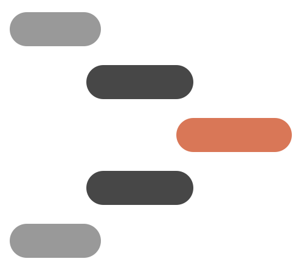

# Shoal brand kit

## Idea

A shoal is a group of fish moving together. Shoal keeps many coding agents moving together in one calm window, and quietly tells you which one needs you. The brand should feel like a well-made instrument: warm, quiet, precise, and confident enough not to shout.

## Color

One accent. Everything else is warm neutrals.

| Name | Hex | Use |
|---|---|---|
| Stone | `#F3F1EC` | App background (light) |
| Paper | `#FBFAF7` | Surfaces, terminal (light) |
| Ink | `#1B1A17` | Text, marks |
| Ink 2 | `#6B675F` | Secondary text |
| Ink 3 | `#A39F95` | Hints, metadata |
| Clay | `#C96442` | The accent: needs-you state, emphasis, cursor |
| Sage | `#3F9B6A` | Working state only |
| Gold | `#DEBE82` | Aurora gradient only |
| Night | `#131312` | App background (dark) |
| Ember | `#1C1B19` | Surfaces (dark) |
| Bone | `#EFECE4` | Text (dark) |
| Clay, dark | `#D97757` | Accent (dark) |

Rules: clay is used sparingly, never as a large fill behind text in the UI. Sage and gold exist only to signal "working" and in the aurora. No pure black or pure white.

## Agent colors

Each agent has one color, used for its Start session button. All take white text; Shell stays neutral and flips to Bone in dark mode.

| Agent | Hex |
|---|---|
| Claude Code | `#C4613D` |
| Codex | `#3A3FE6` |
| Gemini CLI | `#1F6FE5` |
| Hermes | `#8C6A2E` (bronze) |
| Oh My Pi | `#1E6F72` (deep teal) |
| OpenCode | `#3F4A5C` (slate) |
| Ollama | `#6B4A3A` (espresso) |
| Shell | `#1B1A17` (ink) |

## Type

| Role | Typeface | Notes |
|---|---|---|
| Display, wordmark | Instrument Serif | Tight tracking (-0.02 to -0.035em). Italic in clay for the emphasized half of a headline. |
| Interface | Inter | Weight 400 and 500 only. Sentence case. |
| Terminal, paths, data | JetBrains Mono (SF Mono in the app's terminal) | |

All three are open source (OFL).

## Signature elements

- **Aurora**: soft, heavily blurred gold, sage and clay light that drifts across the top of the panel while an agent works, and breathes clay when one needs you.
- **Blur crossfade**: things arrive and leave through a slight blur, never a hard cut or a bounce.
- **Status dots**: a sage dot with a slow spinning ring (working), a clay dot with a soft ping (needs you), a hollow ring (exited).
- **Motion easing**: `cubic-bezier(0.22, 1, 0.36, 1)`. Calm ease-out, no overshoot.

## Voice

Calm, plain and specific. Say what it does. Sentence case, no exclamation marks, no hype words ("seamless", "unlock", "supercharge").

Lines in use:
- All your agents, in one window.
- Know which one needs you.
- Every coding agent, one calm window.

## Logo

Three arrowheads moving together, a shoal. They also read as "run", which is what every session does.

- **Colors carry meaning**: the clay arrow leads (Clay is the "needs you" color), sage follows (working), gold follows (the aurora).
- **Files**: `assets/mark.svg` (the mark on its own), `assets/icon.svg` and `assets/icon.png` (the macOS app icon on an Ink squircle).
- **On dark backgrounds** use the brighter variants: Clay `#D97757`, Sage `#4FAE7B` at full opacity, Gold `#DEBE82`.
- **Lockup**: the mark sits to the left of the "Shoal" wordmark (Instrument Serif), about the wordmark's cap height, with a gap of roughly one arrow's width.
- **Don't** recolor the arrows, rotate the mark, add outlines, shadows or gradients to it, or put it on a busy background.
- **Minimum size**: 16px tall.
